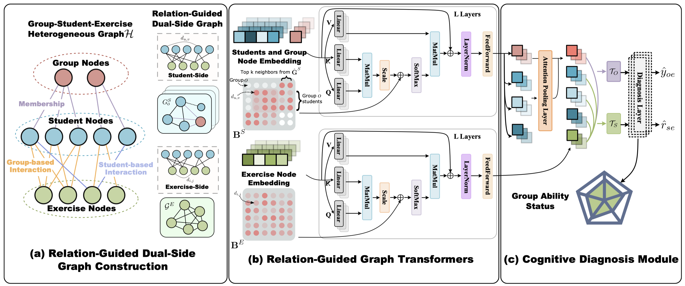
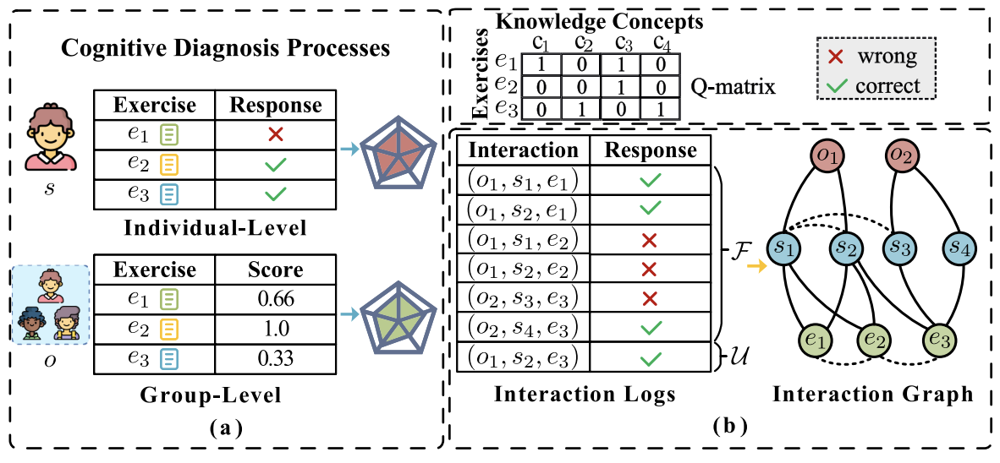

### RDGT: Enhancing Group Cognitive Diagnosis With Relation-Guided Dual-Side Graph Transformer



***

The code in this repository is the implementation of the proposed RDGT model accepted by IEEE TRANSACTIONS ON KNOWLEDGE AND DATA ENGINEERING (TKDE-24), and the used datasets are the public benchmarks including ASSISTment12, NIPS-Edu, SLP-math and SLP-biology, SLP-physics, which can refer to the detailed description in the EXPERIMENTS section.


#### Introduction
Cognitive diagnosis has been widely recognized as a crucial task in the field of computational education, which is capable of learning the knowledge profiles of students and predicting their future exercise performance. Indeed, considerable research efforts have been made in this direction over the past decades. 

However, most of the existing studies only focus on individual-level diagnostic modeling, while the group-level cognitive diagnosis still lacks an in-depth exploration, which is more compatible with realistic collaborative learning environments. 

[//]: # (![RIGL Framework]&#40;./images/hkt_task.png=600x600&#41;)
<div align="center">
    
</div>

To this end, in this paper, we propose a Relation-guided Dual-side Graph Transformer (RDGT) model for achieving effective group-level cognitive diagnosis. Specifically, we first construct the dual-side relation graphs (i.e., student-side and exercise-side) from the group-student-exercise heterogeneous interaction data for explicitly modeling associations between students and exercises, respectively. In particular, the edge weight between two nodes is defined based on the similarity of corresponding student-exercise interactions. Then, we introduce two relation-guided graph transformers to learn the representations of students and exercises by integrating the whole graph information, including both nodes and edge weights. Meanwhile, the inter-group information has been incorporated into the studentside relation graph to further enhance the representations of students. Along this line, we design a cognitive diagnosis module for learning the groups’ proficiency in specific knowledge concepts, which includes an attention-based aggregation strategy to obtain the final group representation and a hybrid loss for optimizing the performance prediction of both group and student. Finally, extensive experiments on 5 real-world datasets clearly demonstrate the effectiveness of our model as well as some interesting findings (e.g., the representative groups and potential collaborations among students). 


#### Dependencies
* python 3.7
* pytorch 1.8
* torch_geometric
* numpy
* pandas
* sklearn
* tqdm


#### Usage
Train and Test the model:
```
python3 main_rdgt.py --dataset_name {dataset_name} --model_name "rdgt" --dir_type {any dir name} --epoch {epoch} --bsz {batch size} --topk {topk} --n_layers {n_layers} --n_heads {n_heads} --gamma {gamma} --dropout {dropout ratio} --lr {learning rate}
```

#### References

* EduCDM: https://github.com/bigdata-ustc/EduCDM

#### BibTex
If you find this work and the code helpful to your research, please kindly consider citing our paper. Thanks!

```
@article{yu2024rdgt,
  title={Rdgt: enhancing group cognitive diagnosis with relation-guided dual-side graph transformer},
  author={Yu, Xiaoshan and Qin, Chuan and Shen, Dazhong and Ma, Haiping and Zhang, Le and Zhang, Xingyi and Zhu, Hengshu and Xiong, Hui},
  journal={IEEE Transactions on Knowledge and Data Engineering},
  year={2024},
  publisher={IEEE}
}
```